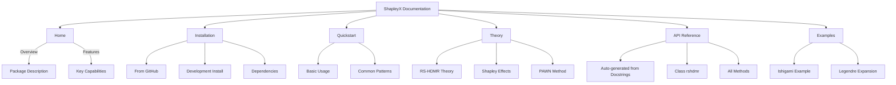

# ShapleyX Documentation Plan

## Documentation Structure

## Implementation Steps

1. Set up Sphinx documentation framework
2. Create documentation content:
   - index.rst (main landing page)
   - installation.rst  
   - quickstart.rst
   - theory.rst
   - API auto-documentation
   - Examples section
3. Configure navigation system
4. Set up GitHub Pages deployment

## Required Tools
- Sphinx
- ReadTheDocs theme
- MathJax support
- Autodoc extension