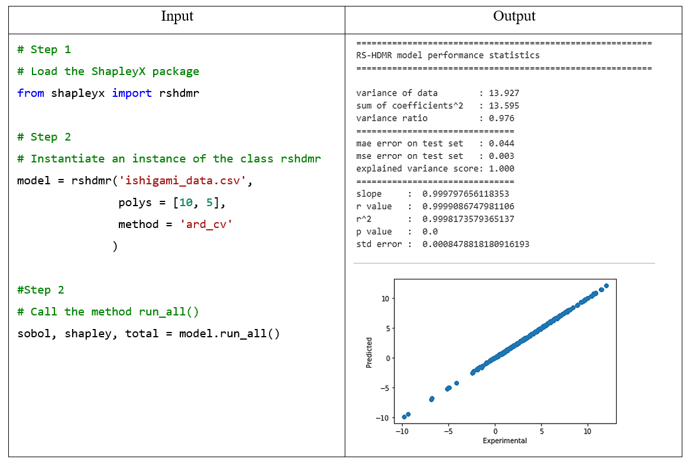

<script type="text/javascript" src="https://cdn.mathjax.org/mathjax/latest/MathJax.js?config=TeX-AMS_HTML"></script>
# Welcome to ShapleyX
ShapleyX is a Python implementation of various methods for parameter sensitivity analysis of tabulated data. 

## Available Methods
* Sobol sensitivity indices to arbitrary order
* Shapley effects
* Owen-Shapley interactions
* PAWN distribution based sensitivity analysis


## Getting Started


ShapleyX package
 
The simplicity and flexibility enables the use and test of different 
algorithms without the need of complex codes:

```
Results here 
```


## Features
Complex algorithms bring complex tasks to link them with a model. 

